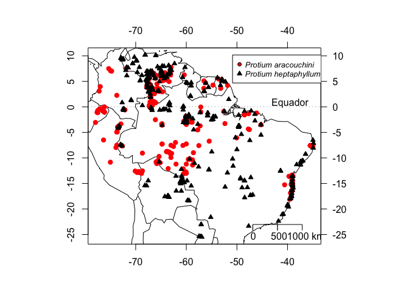

Obtendo dados e plotando mapas no R - Versão 2
================
Ricardo Perdiz  
Instituto Nacional de Pesquisas da Amazônia  
Programa de Pós-graduação em Botânica
05 February 2019

Continuando a reformulação de postagens antigas, reapresento uma
publicada em 2016 sobre [obtenção de dados e plotagem de mapas usando o
R](https://labotam.blogspot.com/2016/04/obtendo-dados-e-plotando-mapas-no-r_19.html).
Fiz correções no script lá apresentado, e eliminei o desnecessário (como
atribuição de pasta de trabalho e caminhos relativos para ler os dados),
de forma a tornar o tutorial abaixo totalmente reprodutível. Por isso,
peço encarecidamente que, uma vez encontrado algum erro, favor me
avisar, para que eu corrija o mais rapidamente possível e você possa
fazer bom uso desta postagem.

Para reproduzir a postagem em seu computador, baixe o arquivo *.Rmd*
juntamente com todos os dados necessários para gerar o mapa reproduzido
no fim desta postagem [neste
link](http://www.botanicaamazonica.wiki.br/labotam/lib/exe/fetch.php?media=alunos:r.perdiz:bloglabotam:perdiz_2018_post_mapa_revisitado.zip),
procure o arquivo de extensão “.Rmd” e abra-o em seu computador,
preferencialmente usando o [RStudio](http://rstudio.com). Execute o
arquivo usando a função `Preview` presente no RStudio e você terá uma
página exatamente a esta aqui disponibilizada. Certifique-se de que
você tenha os pacotes `knitr`, `rmarkdown` e todas as dependências
devidamente instaladas em seu computador.

Esta postagem foi construída usando o formato *R Notebook*. Visite os
links ao fim desta postagem para obter mais informações sobre este
formato e seus benefícios para a reprodutibilidade na Ciência.

-----

O tutorial é bem simples e visa a produção de um mapa de distribuição
geográfica utilizando dados que abrangem a distribuição espacial de duas
espécies de *[Burseraceae](https://en.wikipedia.org/wiki/Burseraceae)*,
*Protium aracouchini* (Aubl.) Marchand e *P. heptaphyllum* (Aubl.)
Marchand. A primeira planta faz parte de um complexo de espécies
informalmente denominado complexo *Protium aracouchini*, cuja
sistemática e taxonomia vem sendo objeto de estudo em [meu
doutorado](http://www.botanicaamazonica.wiki.br/labotam/doku.php?id=alunos:r.perdiz:projeto:inicio).
A segunda espécie, *P. heptaphyllum*, é objeto de estudo de [Gabriel
Damasco](https://ib.berkeley.edu/labs/fine/Site/Gabriel.html),
colaborador do LABOTAM e aluno de doutorado na Universidade da
Califórnia, Berkeley.

Os dados foram baixados do [herbário virtual do Jardim Botânico de Nova
Iorque](http://sweetgum.nybg.org/science/vh/) que é onde trabalha o
especialista em Burseraceae, Dr. Douglas Daly, e cuja coleção de
espécimes e dados vêm sendo bem cuidada há algumas décadas. Para esta
postagem, filtramos apenas os dados para as duas espécies citadas acima.

-----

### Carregando os pacotes

Faremos uso dos pacotes
*[maps](https://cran.r-project.org/web/packages/maps/maps.pdf)* (para
plotar o mapa),
*[RColorBrewer](https://cran.r-project.org/web/packages/RColorBrewer/RColorBrewer.pdf)*
(paleta de cores),
*[magrittr](https://cran.r-project.org/web/packages/magrittr/vignettes/magrittr.html)*
(pipe, ou `%>%`) e
*[dplyr](https://cran.rstudio.com/web/packages/dplyr/vignettes/introduction.html)*
(manipulação de ‘dataframes’) . É imprescindível que todos estejam
atualizados e com as dependências instaladas.

``` r
library(maps)
library(RColorBrewer)
library(magrittr)
library(dplyr)
```

    ## 
    ## Attaching package: 'dplyr'

    ## The following objects are masked from 'package:stats':
    ## 
    ##     filter, lag

    ## The following objects are masked from 'package:base':
    ## 
    ##     intersect, setdiff, setequal, union

### Importando os dados

Os dados estão reunidos em dois arquivos ‘.csv’ separados por tabulação
e codificados em UTF-8. Baixe-os para seu computador:

  - [*Protium
    aracouchini*](http://www.botanicaamazonica.wiki.br/labotam/lib/exe/fetch.php?media=alunos:r.perdiz:nybg_paracouchini.csv)
  - [*Protium
    heptaphyllum*](http://www.botanicaamazonica.wiki.br/labotam/lib/exe/fetch.php?media=alunos:r.perdiz:nybg_pheptaphyllum.csv)

<!-- end list -->

``` r
#protium aracouchini
aracouch <-
    read.table("nybg_paracouchini.csv", header = T, as.is = T, sep = '\t', dec = '.') %>%
    select(recordedBy, recordNumber, decimalLatitude, decimalLongitude, identifiedBy, specificEpithet) %>%
    arrange(recordedBy, recordNumber)
#protium heptaphyllum
heptaphy <- read.table("nybg_pheptaphyllum.csv", header = T, as.is = T, sep = '\t', dec = '.') %>%
    select(recordedBy, recordNumber, decimalLatitude, decimalLongitude, identifiedBy, specificEpithet) %>%
    arrange(recordedBy, recordNumber)
```

### Checa e limpa os dados

Em nosso caso, devemos verificar:

  - existência de valores vazios; em caso positivo, devemos eliminá-los;
  - confiabilidade dos valores de latitude e longitude, às vezes, por
    diversos fatores, há troca de sinais (negativos e positivos)
    ocasionando equívocos quanto à ocorrência exata da amostra. Se for
    percebido algo assim, é bom checar os dados e buscar corrigí-los.

<!-- end list -->

``` r
# une os dados e passa para a proxima acao
dad <- 
    rbind(aracouch,heptaphy) %>%
    #elimina os registros vazios de coletor
    filter(recordedBy != '') %>%
    #elimina os registros sem lat ou long
    filter(decimalLatitude != '' | decimalLongitude != '') %>%
    #filtra apenas os especimes identificados pelo especialista da família Burseraceae
    filter(identifiedBy == 'D. C. Daly')
#ha registros duplicados
#busca-se entao apenas os dados unicos
#limpa os dados de coletor e numero para poder criar um identificador
#limpeza consiste em eliminar '.', espacos vazios, apostrofe e '_' duplos
dad$recordedBy <-
    gsub('\\.', '_', dad$recordedBy) %>%
    gsub(' ', '_', .) %>%
    gsub("'", '_', .) %>%
    gsub('__', '_', .)
#faz-se o mesmo para os numeros de coleta
dad$recordNumber <- 
    gsub('/','_', dad$recordNumber) %>%
    gsub(' ', '_', .) %>%
    gsub('\\.', '_', .)

#cria o identificador de coleta e especie
dados <- dad %>%
    mutate( ID = paste(recordedBy,recordNumber, sep = '_'), Species = paste('Protium', specificEpithet, sep = ' '))
dados$ID <- gsub('__','_',dados$ID)


#quem sao os dados unicos
unicos <- unique(dados$ID)

#agora filtra os dados unicos no dataframe, eliminando os duplicados
#faz-se uso da funcao match para obter esse resultado
prot <- 
    match(unicos, dados$ID) %>%
    dados[.,]
#verifica a cobertura de lat e long para ver se estao dentro
# dos limites da America do Sul
lat <- range(prot$decimalLatitude)
long <- range(prot$decimalLongitude) #aqui tem algo estranho
#percebe-se aqui que ha valores que caem fora da Am Sul
#limite e pouco mais de -80
head(sort(prot$decimalLongitude))
```

    ## [1] -89.3000 -89.3000 -89.3000 -77.9436 -77.6200 -77.6000

``` r
#devemos eliminar
protium <-
    prot %>%
    filter(decimalLongitude > -80)
```

### Cria variáveis para plotar o mapa

``` r
#vetor com epitetos especificos
spp <- unique(protium$Species)

#vetor de cores para utilizar no mapa
#para cada especie, uma cor
protium$cores.map <- ifelse(protium$Species == spp[1], 'red','black')
cores.map <- protium$cores.map

#cria um vetor de tamanho para cada especie
#como uma coluna de protium
#P heptaphyllum possui uma distribuicao mais ampla
#por isso atribuo um tamanho menor pra ela
protium$cex.p <- ifelse(protium$Species == spp[1], 1, 0.8)

# vetor contendo dados de latitude e longitude em objetos separados
lat <- protium$decimalLatitude
long <- protium$decimalLongitude

# amplitude de lat e long para lat e long
y1 <- range(lat) + c(-1,1)
x1 <- range(long) + c(-1,1)

#vetor para os simbolos pch
protium$pontos <- ifelse(protium$Species == spp[1], 21, 24)

#vetor para paises
paises <- c('Brazil','Argentina','Peru','Paraguay','Ecuador','Chile','Uruguay','French Guiana','Suriname','Venezuela','Colombia','Guyana','Bolivia','Panama','Costa Rica')
```

### Plota o mapa

``` r
#plota o mapa
map(regions = paises, fill = F, xlim = x1, ylim = y1) 

#plota os pontos de ocorrencia de cada especie
points(long,lat, pch = protium$pontos, col = cores.map, bg = cores.map, cex = protium$cex.p)

#coloca eixos das coordenadas
map.axes()
axis(side=4,las=1)
axis(side=3,las=1)

#coloca escala do mapa
par(cex=1, las=1)
map.scale(max(long) - 12, ratio = F, cex = 1, metric = T)

#plota a linha do equador
abline(h=0,lwd=0.5,lty="dotted")
#nomeia a linha do equador
text(x = max(long) - 1, y = 1,labels="Equador", cex=1, adj=c(1,0.5))
#plota uma legenda
legend(max(long) - 16 , max(lat),legend = spp, pch = unique(protium$pontos), pt.bg = unique(cores.map), cex = 0.8, x.intersp = 0.8, text.font = 3)
```

<!-- -->

## Salva plot em um pdf

Pode-se salvar também este mapa em um pdf, utilizando a função `pdf()`.
Veja abaixo.

``` r
### Cria um pdf e Plota o mapa 
pdf('meu_mapa_complexo_protium_aracouchini_e_heptaphyllum.pdf',height=8,width=10)
map(regions = paises, fill = F, xlim = x1, ylim = y1) 
points(long,lat, pch = protium$pontos, col = cores.map, bg = cores.map, cex = protium$cex.p)
map.axes()
axis(side=4,las=1)
axis(side=3,las=1)
par(cex=1, las=1)
map.scale(max(long) - 12, ratio = F, cex = 1, metric = T)
abline(h=0,lwd=0.5,lty="dotted")
text(x = max(long) - 1, y = 1,labels="Equador", cex=1, adj=c(1,0.5))
legend(max(long) - 16 , max(lat),legend = spp, pch = unique(protium$pontos), pt.bg = unique(cores.map), cex = 0.8, x.intersp = 0.8, text.font = 3)
dev.off()
```

    ## quartz_off_screen 
    ##                 2

-----

### Informações sobre esta postagem

Esta postagem foi escrita em ambiente R utilizando os pacotes [R
Markdown](http://rmarkdown.rstudio.com/) e
[knitr](http://yihui.name/knitr/).

Dúvidas, sugestões, erros no script, favor entrar em contato comigo, via
comentários, ou por email.

Esta postagem completa, incluindo os blocos de código, podem ser lidos
inteiramente neste
[link](https://gist.github.com/ricoperdiz/1a7d0a3234cbea544c0fcb70f13b205d).
Lá você pode copiar o arquivo bruto para o seu computador e modificá-lo
à vontade.

Divirta-se\!\!\!

-----

### Saiba mais

  - [Making maps with
    R](http://www.molecularecologist.com/2012/09/making-maps-with-r/)
  - [Maps in R: Introduction](http://www.milanor.net/blog/?p=534)
  - [R notebooks](https://rmarkdown.rstudio.com/r_notebooks.html)
  - [Why I love R
    Notebooks](https://rviews.rstudio.com/2017/03/15/why-i-love-r-notebooks/)
  - [Advantages of Using R Notebooks For Data Analysis Instead of
    Jupyter Notebooks](http://minimaxir.com/2017/06/r-notebooks/)
  - [Reproducible Research Using RMarkdown and Git through
    RStudio](https://rpubs.com/marschmi/105639)
