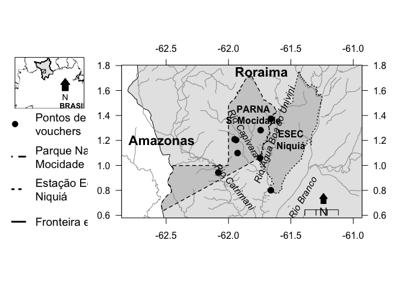

Composição de mapas em R
================
Ricardo Perdiz  
Instituto Nacional de Pesquisas da Amazônia  
Programa de Pós-graduação em Botânica
05 February 2019

Esta postagem é uma reformulação de uma anterior, publicada em 2017,
neste mesmo blog (veja-a
[aqui](https://labotam.blogspot.com/2017/06/uso-da-funcao-layout-na-composicao-de.html)).
Aqui ela é apresentada na forma de um [**R
notebook**](https://youtu.be/GG4pgtfDpWY). Foram feitas algumas
modificações a fim de torná-la totalmente reprodutível, isto é, você
pode executar este arquivo do início ao fim que ele vai rodar, **desde
que** você tenha os pacotes necessários instalados em seu computador.

-----

Os scripts abaixo reproduzem o mapa publicado recentemente em [Rodrigues
*et al.*
(2017)](http://rodriguesia.jbrj.gov.br/FASCICULOS/rodrig68-2/29-0140-2016.pdf)
(caso você possua conta no ResearchGate, pode visualizar o trabalho
neste
[link](https://www.researchgate.net/publication/317671892_Novas_ocorrencias_de_angiospermas_para_o_estado_de_Roraima_Brasil)).
O mapa principal apresenta localidades de coleta de espécimes de plantas
em duas unidades de conservação do estado de Roraima. A maioria dessas
coletas foram feitas durante a expedição [*Terra
Incognita*](https://www.youtube.com/watch?v=M7o1avCPSjs), ocorrida em
dezembro de 2013, organizada pelas equipes gestoras do Parque Nacional
Serra da Mocidade e Estação Ecológica de Niquiá, com financiamento da
ARPA. Veja mais detalhes sobre a expedição ao fim desta postagem.

-----

### Carrega os pacotes

Para gerar o mapa desta postagem, fiz uso dos pacotes
    abaixo:

  - *[broom](https://cran.r-project.org/web/packages/broom/vignettes/broom.html)*;
  - *[dplyr](https://cran.r-project.org/web/packages/dplyr/vignettes/dplyr.html)*;
  - *[GISTools](https://cran.r-project.org/web/packages/GISTools/GISTools.pdf)*;
  - *[maps](https://cran.r-project.org/web/packages/maps/maps.pdf)*;
  - *[rgdal](https://cran.r-project.org/web/packages/rgdal/rgdal.pdf)*.

É imprescindível que todos estejam instalados, atualizados e com as
dependências instaladas.

``` r
library(broom)
library(dplyr)
```

    ## 
    ## Attaching package: 'dplyr'

    ## The following objects are masked from 'package:stats':
    ## 
    ##     filter, lag

    ## The following objects are masked from 'package:base':
    ## 
    ##     intersect, setdiff, setequal, union

``` r
library(GISTools)
```

    ## Loading required package: maptools

    ## Loading required package: sp

    ## Checking rgeos availability: TRUE

    ## Loading required package: RColorBrewer

    ## Loading required package: MASS

    ## 
    ## Attaching package: 'MASS'

    ## The following object is masked from 'package:dplyr':
    ## 
    ##     select

    ## Loading required package: rgeos

    ## rgeos version: 0.4-2, (SVN revision 581)
    ##  GEOS runtime version: 3.6.1-CAPI-1.10.1 
    ##  Linking to sp version: 1.3-1 
    ##  Polygon checking: TRUE

``` r
library(maps)
```

    ## 
    ## Attaching package: 'maps'

    ## The following object is masked from 'package:GISTools':
    ## 
    ##     map.scale

``` r
library(rgdal)
```

    ## rgdal: version: 1.3-6, (SVN revision 773)
    ##  Geospatial Data Abstraction Library extensions to R successfully loaded
    ##  Loaded GDAL runtime: GDAL 2.1.3, released 2017/20/01
    ##  Path to GDAL shared files: /Library/Frameworks/R.framework/Versions/3.5/Resources/library/rgdal/gdal
    ##  GDAL binary built with GEOS: FALSE 
    ##  Loaded PROJ.4 runtime: Rel. 4.9.3, 15 August 2016, [PJ_VERSION: 493]
    ##  Path to PROJ.4 shared files: /Library/Frameworks/R.framework/Versions/3.5/Resources/library/rgdal/proj
    ##  Linking to sp version: 1.3-1

### Importa os dados

``` r
#dados dos pontos de coleta dos vouchers
new.reg.voucher <- read.table('rodrigues_etal_2017_coordenadas_novos_registros.csv',header=T,as.is=T,sep='\t')

#kml do PARNA S Mocidade e ESEC Niquia
mocidade <- rgdal::readOGR(dsn='parna_serra_da_mocidade.kml',layer='sql_statement')
```

    ## OGR data source with driver: KML 
    ## Source: "/Users/ricoperdiz/Documents/Tutorials/R_map_with_layout/parna_serra_da_mocidade.kml", layer: "sql_statement"
    ## with 1 features
    ## It has 2 fields

``` r
niquia <- rgdal::readOGR(dsn='esec_niquia.kml',layer='sql_statement')
```

    ## OGR data source with driver: KML 
    ## Source: "/Users/ricoperdiz/Documents/Tutorials/R_map_with_layout/esec_niquia.kml", layer: "sql_statement"
    ## with 1 features
    ## It has 2 fields

``` r
#shape da Am Sul e Central
area.mapa <- rgdal::readOGR(dsn = 'SAm_CAm_shape.shp')
```

    ## OGR data source with driver: ESRI Shapefile 
    ## Source: "/Users/ricoperdiz/Documents/Tutorials/R_map_with_layout/SAm_CAm_shape.shp", layer: "SAm_CAm_shape"
    ## with 37 features
    ## It has 65 fields

``` r
#shape de RR
rr <- rgdal::readOGR(dsn = 'roraima.shp')
```

    ## OGR data source with driver: ESRI Shapefile 
    ## Source: "/Users/ricoperdiz/Documents/Tutorials/R_map_with_layout/roraima.shp", layer: "roraima"
    ## with 1 features
    ## It has 8 fields
    ## Integer64 fields read as strings:  MSLINK MAPID

``` r
#shape de rios em RR
rios.main <- rgdal::readOGR(getwd(),'rios',encoding='latin1')
```

    ## OGR data source with driver: ESRI Shapefile 
    ## Source: "/Users/ricoperdiz/Documents/Tutorials/R_map_with_layout", layer: "rios"
    ## with 1849 features
    ## It has 16 fields
    ## Integer64 fields read as strings:  FNODE_ TNODE_ LPOLY_ RPOLY_ RIV3M_W_ RIV3M_W_ID

``` r
rios.sec <- rgdal::readOGR(getwd(),'rios2',encoding='latin1')
```

    ## OGR data source with driver: ESRI Shapefile 
    ## Source: "/Users/ricoperdiz/Documents/Tutorials/R_map_with_layout", layer: "rios2"
    ## with 1624 features
    ## It has 1 fields
    ## Integer64 fields read as strings:  FID

    ## Warning in rgdal::readOGR(getwd(), "rios2", encoding = "latin1"): Dropping
    ## null geometries: 1, 2, 3, 4, 5, 6, 7, 8, 9, 10, 11, 12, 13, 14, 15, 16, 17,
    ## 18, 19, 20, 21, 22, 23, 24, 25, 26, 27, 28, 29, 30, 31, 32, 33, 34, 35, 36,
    ## 37, 38, 39, 40, 41, 42, 43, 44

### Cria variáveis para os plots

``` r
# para o mapa de referencia
#amplitude de long
x1 <- c(-70,-50)
y1 <- c(-10,5)

#vetor de tamanho para o cex
cex.tam <- seq(0.8,1.6,by=0.1)

#vetor com tipos de pontos
pontos <- c(17:25)

#amplitude de lat e long - vetores
lat_long <- dplyr::full_join(tidy(mocidade), tidy(niquia))
```

    ## Regions defined for each Polygons
    ## Regions defined for each Polygons

    ## Joining, by = c("long", "lat", "order", "hole", "piece", "group", "id")

``` r
y.geral <- range(lat_long$lat) + c(-0.01,0.01)
x.geral <- range(lat_long$long) + c(-0.01,0.01)
```

### Compõe um gráfico para acomodar os diferentes plots e plota cada mapa

À primeira vista, repare que a figura, por ser composta de três plots
individuais, pode não parecer bem ajustada devido aos dispositivos de
visualização

``` r
#layout do mapa
mapa.layout <- graphics::layout(
    mat = matrix(c(1,1,2,2,2,2,2,2,3,3,2,2,2,2,2,2,3,3,2,2,2,2,2,2),nrow=3,byrow=T),
    widths=rep(2/8,8),
    heights=rep(1/3,3),
    respect=T)
# plot 1
par(mar=c(0,2,2,2))
plot(area.mapa,xlim=x1,ylim=y1,lwd=0.2)
plot(rr,add=T,col='gray90')
#plota um retangulo na area do mapa da direita
rect(xleft = min(x.geral), ybottom = min(y.geral), xright = 
         max(x.geral), ytop = max(y.geral), density = 25)
#coloca escala do mapa
par(cex=1, las=1)
#library(GISTools)
# inclui o NORTE
GISTools::north.arrow(max(x1)-5,max(y1)-10,len=1,cex.lab=0.9,lab='N', col = 'black')
#coloca um texto para avisar quem é Brasil e Guiana
text(-58,-10,labels='BRASIL',pos=4,cex=cex.tam[1],font=2)
box()
# plot 2
par(mar=c(2,2,2,3))
#plota o mapa das uc`s com dados específicos
plot(rr,col='gray90',xlim=x.geral,ylim=y.geral,lwd=1,lty=1) #default lwd=1,lty=1

plot(mocidade,add=T,lty=0,col='gray80')
plot(niquia,add=T,lty=0,col='gray80')

#plota os rios
plot(rios.main,add=T,col='gray60')
plot(rios.sec,add=T,col='gray60')

#plota as areas dos mapas
plot(mocidade,add=T,lwd=1.4,lty=2)
plot(niquia,add=T,lwd=1.4,lty=3)

#plota os pontos de coleta
points(new.reg.voucher$long,new.reg.voucher$lat,pch=pontos[3],col='black',cex=1.4)

#coloca nome dos rios
text(x=-61.42,y=0.8,labels='Rio Branco',pos=1,srt=60,font=3)
text(x=-61.65,y=1.3,labels='Rio Água Boa do Univini',pos=1,srt=70,font=3)
text(x=-61.97,y=0.77,labels='Rio Catrimani',pos=3,srt=-50,font=3)
text(x=-61.9,y=1.2,labels='Rio Capivara',pos=3,srt=-60,font=3)
#coloca nome das UC's
text(x=-61.80,y=1.5,labels='PARNA\nS. Mocidade',pos=1,font=2)
text(x=-61.50,y=1.3,labels='ESEC\nNiquiá',pos=1,font=2)

# coloca um texto para informar área do Amazonas e Roraima
text(-62.845,sum(range(y.geral))/2,labels='Amazonas',pos=4,cex=1.4,font=2)
text((sum(range(x.geral))/2)-0.1,max(y.geral)-0.02,labels='Roraima',pos=4,cex=1.4,font=2)

#coloca escala do mapa
par(cex=1, las=1)
maps::map.scale(max(x.geral) - 0.15, min(y.geral)+0.02, relwidth = 0.10, ratio = F, cex = 1, metric = T, col = 'black')
#coloca o Norte
GISTools::north.arrow(max(x.geral),min(y.geral)+0.07,len=0.02,lab='N',cex.lab=1.2,lwd=1.5,col='black')
#coloca eixos das coordenadas
maps::map.axes()
axis(side=4,las=1)
axis(side=3,las=1)

# plot 3 - LEGENDA
par(mar = c(1,1,0,1))
plot.new()
par(cex = 1.2)
legend(x = 'center', ncol = 1, legend = 
           c('Pontos de coleta dos\nvouchers','Parque Nacional Serra da\nMocidade','Estação Ecológica de\nNiquiá','Fronteira entre estados','Cursos de água'),
       pch = c(pontos[3], NA, NA, NA, NA), col = c('black','black','black','black','gray60'), title = 'LEGENDA',
       cex = cex.tam[3], lty = c(0,2,3,1,1), pt.lwd = 2, text.width = 0.8, lwd = 3, y.intersp = 1.8)
```

<!-- -->

### Caso queira gerar um pdf com a figura acima…

Execute o código abaixo e terás, então, um pdf com a imagem acima. A
mágica ocorre devido à função `pdf()`, inserida antes da execução da
função
`layout`.

``` r
pdf(paste('rodriguesetal2017_mapa_final.pdf',sep=''),height=7,width=14,onefile=T)
#layout do mapa
mapa.layout <- graphics::layout(
    mat = matrix(c(1,1,2,2,2,2,2,2,3,3,2,2,2,2,2,2,3,3,2,2,2,2,2,2),nrow=3,byrow=T),
    widths=rep(2/8,8),
    heights=rep(1/3,3),
    respect=T)
# plot 1
par(mar=c(0,2,2,2))
plot(area.mapa,xlim=x1,ylim=y1,lwd=0.2)
plot(rr,add=T,col='gray90')
#plota um retangulo na area do mapa da direita
rect(xleft = min(x.geral), ybottom = min(y.geral), xright = 
         max(x.geral), ytop = max(y.geral), density = 25)
#coloca escala do mapa
par(cex=1, las=1)
#library(GISTools)
# inclui o NORTE
GISTools::north.arrow(max(x1)-5,max(y1)-10,len=1,cex.lab=0.9,lab='N', col = 'black')
#coloca um texto para avisar quem é Brasil e Guiana
text(-58,-10,labels='BRASIL',pos=4,cex=cex.tam[1],font=2)
box()
# plot 2
par(mar=c(2,2,2,3))
#plota o mapa das uc`s com dados específicos
plot(rr,col='gray90',xlim=x.geral,ylim=y.geral,lwd=1,lty=1) #default lwd=1,lty=1

plot(mocidade,add=T,lty=0,col='gray80')
plot(niquia,add=T,lty=0,col='gray80')

#plota os rios
plot(rios.main,add=T,col='gray60')
plot(rios.sec,add=T,col='gray60')

#plota as areas dos mapas
plot(mocidade,add=T,lwd=1.4,lty=2)
plot(niquia,add=T,lwd=1.4,lty=3)

#plota os pontos de coleta
points(new.reg.voucher$long,new.reg.voucher$lat,pch=pontos[3],col='black',cex=1.4)

#coloca nome dos rios
text(x=-61.42,y=0.8,labels='Rio Branco',pos=1,srt=60,font=3)
text(x=-61.65,y=1.3,labels='Rio Água Boa do Univini',pos=1,srt=70,font=3)
text(x=-61.97,y=0.77,labels='Rio Catrimani',pos=3,srt=-50,font=3)
text(x=-61.9,y=1.2,labels='Rio Capivara',pos=3,srt=-60,font=3)
#coloca nome das UC's
text(x=-61.80,y=1.5,labels='PARNA\nS. Mocidade',pos=1,font=2)
text(x=-61.50,y=1.3,labels='ESEC\nNiquiá',pos=1,font=2)

# coloca um texto para informar área do Amazonas e Roraima
text(-62.845,sum(range(y.geral))/2,labels='Amazonas',pos=4,cex=1.4,font=2)
text((sum(range(x.geral))/2)-0.1,max(y.geral)-0.02,labels='Roraima',pos=4,cex=1.4,font=2)

#coloca escala do mapa
par(cex=1, las=1)
maps::map.scale(max(x.geral) - 0.15, min(y.geral)+0.02, relwidth = 0.10, ratio = F, cex = 1, metric = T, col = 'black')
#coloca o Norte
GISTools::north.arrow(max(x.geral),min(y.geral)+0.07,len=0.02,lab='N',cex.lab=1.2,lwd=1.5,col='black')
#coloca eixos das coordenadas
maps::map.axes()
axis(side=4,las=1)
axis(side=3,las=1)

# plot 3 - LEGENDA
par(mar = c(1,1,0,1))
plot.new()
par(cex = 1.2)
legend(x = 'center', ncol = 1, legend = 
           c('Pontos de coleta dos\nvouchers','Parque Nacional Serra da\nMocidade','Estação Ecológica de\nNiquiá','Fronteira entre estados','Cursos de água'),
       pch = c(pontos[3], NA, NA, NA, NA), col = c('black','black','black','black','gray60'), title = 'LEGENDA',
       cex = cex.tam[3], lty = c(0,2,3,1,1), pt.lwd = 2, text.width = 0.8, lwd = 3, y.intersp = 1.8)
dev.off()
```

    ## quartz_off_screen 
    ##                 2

### Informações sobre esta postagem

Esta postagem foi escrita em ambiente R utilizando os pacotes [R
Markdown](http://rmarkdown.rstudio.com/) e
[knitr](http://yihui.name/knitr/).

Divirta-se\!\!\!

-----

#### **Sobre as unidades de conservação aqui citadas**

O Parque Nacional (PARNA) Serra da Mocidade e a Estação Ecológica (ESEC)
de Niquiá são unidades de conservação federal situadas no município de
Caracaraí, no estado de Roraima, Brasil. O PARNA Serra da Mocidade
possui uma área de 350.960 hectares e caracteriza-se pela ocorrência de
uma serra isolada, com aproximadamente 1.800 metros de altitude,
localizada no limite da unidade conservação com a área indígena
Yanomami. Por outro lado, a ESEC Niquiá possui 284.787,42 hectares,
apresentando na sua maior parte áreas planas, com duas elevações ente
200-500 m de altitude.

#### **Sobre a expedição**

No período de 04 a 18 de dezembro o Parque Nacional Serra da Mocidade e
a Estação Ecológica Niquiá realizaram a Expedição de Pesquisa Científica
*Terra incognita*, nomeada em alusão à Hamilton Rice, explorador
americano que assim chamou a região oeste de Roraima em seu livro
Exploração à Guiana Brasileira. Financiada com recursos do Programa ARPA
(Áreas Protegidas da Amazônia), a expedição reuniu várias instituições
(Instituto Chico Mendes de Conservação da Biodiversidade/ICMBio,
Universidade Federal de Roraima/UFRR, Instituto de Amparo à Ciência e
Tecnologia do Estado de Roraima/IACTI, Universidade Federal do
Amazonas/UFAM, Centro de Estudos da Biodiversidade
Amazônica/CENBAM/PPBio, Secretaria do Patrimônio da União/SPU e
Instituto Federal de Roraima/IFRR) e pesquisadores de diversas áreas do
conhecimento, que se propuseram a levantar informações sobre uma região
pouco conhecida pela ciência, buscando contribuir com a elaboração dos
planos de manejo das unidades, ora em execução.

Vejam este [link](https://www.youtube.com/watch?v=M7o1avCPSjs) para ter
acesso a um pequeno documentário sobre algumas das descobertas dessa
viagem.

-----

#### **Saiba mais**

  - [R plot layout](http://research.stowers.org/mcm/plotlayout.pdf);
  - [Multipanel plotting in R (with base
    graphics)](http://seananderson.ca/courses/11-multipanel/multipanel.pdf).

##### *Para conferir o trabalho onde esse mapa foi publicado siga o link abaixo*:

  - [Rodrigues et al. 2017. Novas ocorrências de angiospermas para o
    estado de Roraima, Brasil.
    Rodriguésia](http://rodriguesia.jbrj.gov.br/FASCICULOS/rodrig68-2/29-0140-2016.pdf)
    - Link no
    [*ResearchGate*](https://www.researchgate.net/publication/317671892_Novas_ocorrencias_de_angiospermas_para_o_estado_de_Roraima_Brasil).

#### *Para ver outros mapas produzidos da mesma maneira*:

  - [Lavor et al. 2016. Rediscovery of Pilosocereus oligolepsis
    (Cactaceae) in the State of Roraima, Brazil. Cactus and Succulent
    Journal 88(3):137-143](http://www.bioone.org/doi/abs/10.2985/015.088.0306?journalCode=casu)
    - Link no
    [ResearchGate](https://www.researchgate.net/publication/304000968_Rediscovery_of_Pilosocereus_oligolepsis_Cactaceae_in_the_State_of_Roraima_Brazil);

  - [Barbosa et al. 2017. Decomposition rates of coarse woody debris in
    undisturbed Amazonian seasonally flooded and unflooded forests in
    the Rio Negro-Rio Branco Basin in Roraima, Brazil. Forest Ecology
    and
    Management 397(1)](http://www.sciencedirect.com/science/article/pii/S0378112716310866)
    - Link no
    [ResearchGate](https://www.researchgate.net/publication/316583130_Decomposition_rates_of_coarse_woody_debris_in_undisturbed_Amazonian_seasonally_flooded_and_unflooded_forests_in_the_Rio_Negro-Rio_Branco_Basin_in_Roraima_Brazil-NC-ND_license_httpcreativecommonsorglic).

#### Referências dos pacotes de R

  - Original S code by Richard A. Becker, Allan R. Wilks. R version by
    Ray Brownrigg. Enhancements by Thomas P Minka and Alex Deckmyn.
    (2017). maps: Draw Geographical Maps. R package version 3.2.0.
    <https://CRAN.R-project.org/package=maps>

  - Roger Bivand, Tim Keitt and Barry Rowlingson (2017). rgdal: Bindings
    for the Geospatial Data Abstraction Library. R package version
    1.2-7. <https://CRAN.R-project.org/package=rgdal>

  - Chris Brunsdon and Hongyan Chen (2014). GISTools: Some further GIS
    capabilities for R. R package version 0.7-4.
    <https://CRAN.R-project.org/package=GISTools>

  - David Robinson (2017). broom: Convert Statistical Analysis Objects
    into Tidy Data Frames. R package version 0.4.2.
    <https://CRAN.R-project.org/package=broom>

  - Hadley Wickham, Romain Francois, Lionel Henry and Kirill Müller
    (2017). dplyr: A Grammar of Data Manipulation. R package version
    0.7.0. <https://CRAN.R-project.org/package=dplyr>
